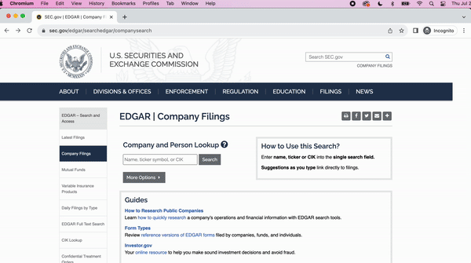
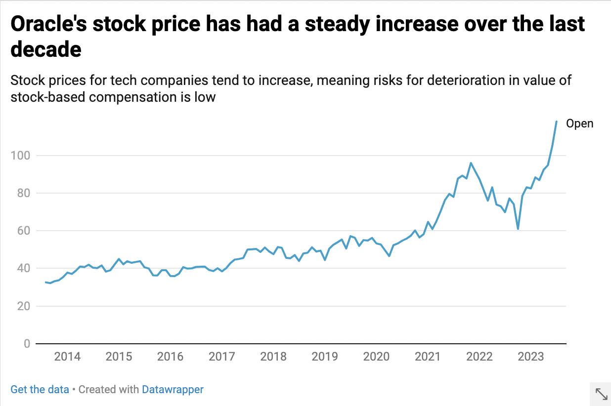
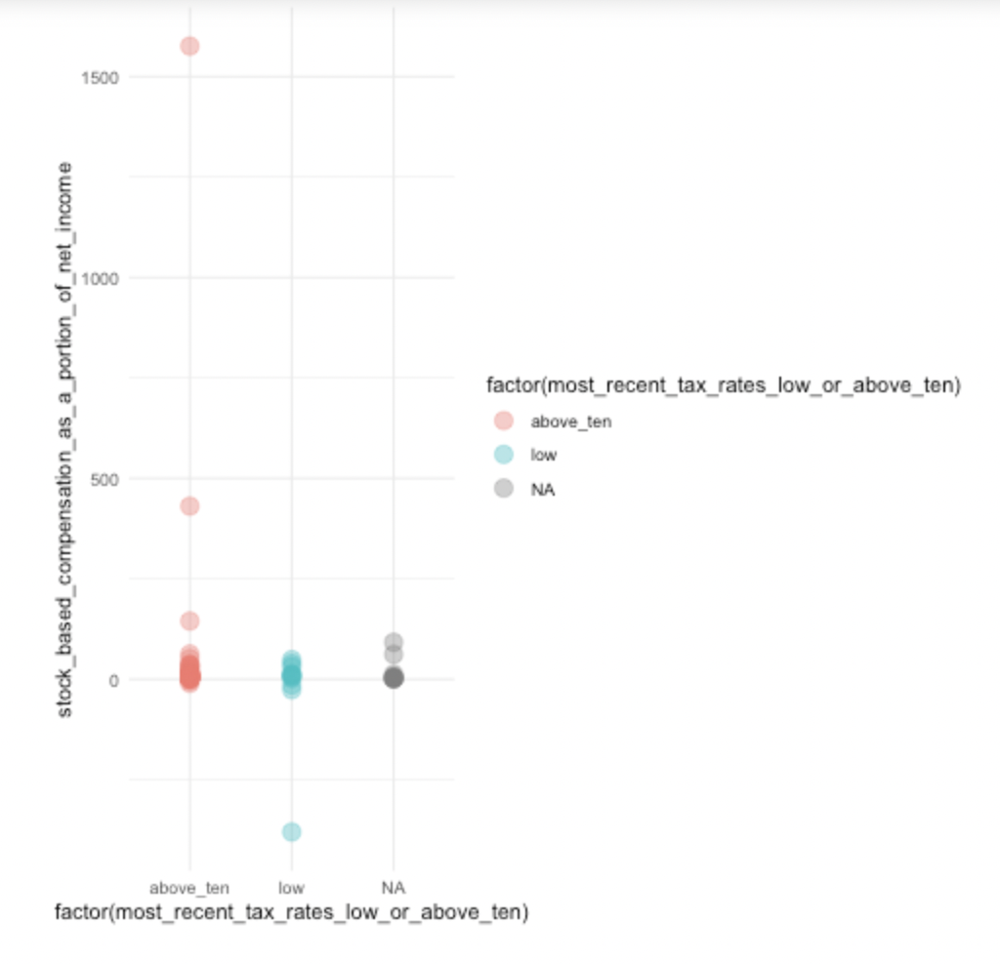

# [Creating a scraper for cash flows statement for SEC filings.](https://www.sec.gov/)


This is a project in which I automate the extraction of details from the cash flow statements of different companies for SEC filings. <br/>
Here is a video of the main process that I want to automate



This methodology is divided into:
1) Getting the Data
2) Analysing the Data

## Getting the Data

My universe of data for this project is the companies with the highest market capitalisation in the United States as of Wednesday, 5th July 2023. 

### Preparing the Data
Here is [a notebook where you can follow along](preparing_top_company_plus_sec_titles_data.ipynb) to see the details for this section.
#### Here is the [source](https://companiesmarketcap.com/) for the 100 companies at the top of this list

* I used Playwright to extract this list since requests produced an error regarding automated scraping. 

### In order to use the data to access SEC filings, it would be easier to have the titles as listed on SEC. Therefore, I found the formal titles on SEC's site

#### Here is the [source](https://www.sec.gov/files/company_tickers.json) for all public companies' details. 
To get the json, I simply copy-pasted the content and assigned the variable since that was faster than getting around site blockers. I converted the json to a dataframe with the following columns:
* Company CIK
* Company ticker
* Company title

### Merging the Data
Since the names in the top 100 list are slightly different from the official SEC titles, I use fuzzymatching to merge the lists on the appropriate columns, resulting in a top 100 list which includes the titles that are more searchable on the SEC website

```
from fuzzywuzzy import fuzz
from fuzzywuzzy import process

# Define a function to find the best fuzzy match for each title
def find_best_match(title):
    choices = df_company_tickers_transposed['title'].tolist()  # Update column name to 'title'
    best_match, score = process.extractOne(str(title), choices)  # Convert title to string
    if score >= 80:  # Adjust the threshold as needed
        return best_match
    else:
        return None

# Apply the function to find the best matches for each title in df_large_companies_us_soup_doc_table
df_large_companies_us_soup_doc_table['best_match'] = df_large_companies_us_soup_doc_table['Name'].apply(find_best_match)

# Merge the dataframes based on the best matches
merged_df = pd.merge(df_large_companies_us_soup_doc_table, df_company_tickers_transposed, left_on='best_match', right_on='title', how='inner')  # Update column name to 'title'

# Remove the intermediate 'best_match' column
merged_df.drop('best_match', axis=1, inplace=True)

# Print the merged dataframe
print(merged_df)

```

### Now to scrape the data

There are two major processes to figure out for the scraper to work:
1) Get a list of the links of the most recent 10K documents
2) Go into each 10K document link and withdraw the stock-based compensation details <br/>

# Get a list of the links of the most recent 10K documents
Here is [a notebook where you can follow along](for_10_K_get_links.ipynb) to see the details for this section.

ON THE SEC PAGE
1) Go to the SEC Home Page
2) Enter the title as retrieved from SEC's website
3) Click search

ON THE PAGE RESULTING FROM SEARCH OF SPECIFIC COMPANY
1) Search for 10-K using playwright
2) Use requests to read resulting page
3) Retrieve the first 10-K Document link (the first is the most recent one)
4) Use playwright to go to the link resulting. It has the most recent 10-K document and graphics

ON THE PAGE RESULTING FROM LINK OF MOST RECENT 10-K DOCUMENT AND GRAPHICS 
1) Retrieve content using requests
2) Extract the link that is specific to the document not the graphics


# Go into each 10K document link and withdraw the stock-based compensation details
Here is [a notebook where you can follow along](https://github.com/ivynyayieka/tech_sec/blob/main/for_10_K_automate_stock_collection.ipynb) to see the details for this section.

Here, there are two major goals:
1) Navigate to the cash flows statements table
2) Extract the details of the stock-based compensation expense 
* For reference, here is an example of Apple's [most recent 10-K Document](https://www.sec.gov//ix?doc=/Archives/edgar/data/320193/000032019322000108/aapl-20220924.htm) for reference
<insert picture>

ON THE 10K DOCUMENT LINK 

1) Await loading by including a time delay
2) Scroll down the page to ensure that it all loads
3) Only after that is it then possible to use requests to extract the content

## Navigate to the cash flows statements table
1) Usually the cash flows statements have the following titles:
* CONSOLIDATED STATEMENTS OF CASH FLOWS
* CASH FLOWS STATEMENTS <br/>
I used this information to trace the table. 
> This extraction did not always work, presumably because sometimes the words were used earlier in the document rather than as a title for the table. One way could be checking if something that often appears reliably is present in the table extracted eg Net income and loss and if not to proceed to the next instance of the word. (Would not use stock-based compensation detail because it does not always appear eg for companies where this is not relevant)
2) In this current iteration, I find the title then find the next table appearing. 

## Extract the details of the stock-based compensation expense 
1) Usually the row with stock-based compensation details will appear with the following title cell:
* Stock-based compensation expense
* Share-based compensation expense
* Stock-based compensation
* Share-based compensation <br/>
I used this information to find the table cell which has the stock-related details I want. 
2) I go to the parent of the cell, the table row and extract all table cells in the row
3) I extract all values in the row
4) To get the values, I create a mini-list within all extracted values which includes only the cells with numbers (Some are empty, others are just the % or $. Usually I get three values, usually for the last 3 years)


# Analysing the Data
## Analysis of stock-based compensation expenses and taxes
## How I selected the universe of data
I selected the top 100 companies by market capitalisation to have a defined dataset.
Since I am interested in public companies which offered significant stock-based compensation expenses and whether there was a relationship to the size of their effective tax rate, it would be interesting to analyse all the public companies instead. However, the process required to manage the automatic and manual collection of such data would require more time than the initial scope of this project allowed. 

## Guide for data collected
##### Net income: 
I collected this because I felt that stock-based compensation expenses would make the most sense if they were normalised over net income.
##### Effective tax rate: 
I collected this in order to evaluate if there is any significant relationship between stock-based compensation expenses and tax rates.
##### Income tax benefit related to share-based compensation expense: 
I collected this where it was visible in the 10K because it was the way to see the direct impact of share-based compensation expense.

Here is the [CSV](df_stock_top_us_plus_sec_titles_with_links_after_copy_paste.csv) with all the data that was collected

### For Oracle
To collect Oracle's stock-based compensation expenses for individuals, I used the [company's form 14A](https://www.sec.gov/Archives/edgar/data/1341439/000119312522250158/d357923ddef14a.htm) 

To get [Oracle's historical data](https://query1.finance.yahoo.com/v7/finance/download/ORCL?period1=1374710400&period2=1690243200&interval=1mo&events=history&includeAdjustedClose=true), I looked at the stock prices for the last decade and used Datawrapper to make a chart


# Statistical analysis

# T Test
Here is [a notebook where you can follow along](sec_t_test_analysis.ipynb) to see the details for this section.

Question:
## Are effective tax rates for companies below or above ten depending on the stock compensation expense?
#### Null hypothesis:
There is no difference between the stock-based compensation expenses for companies where the effective tax rates are above or below 10%
#### Plotting

In this t-test, I test whether there is a difference between the effective tax rates of companies are below or above ten depending on the stock-based compensation expense.
* The p-value in this case is large at 0.127, indicating there is no statistically significant difference between the stock-based compensation expense depending on whether the effective tax rates of companies are below or above ten. This is a conclusion that can be supported by the initial plotting of the data which showed the data may be randomly distributed.

Question:
## Normalised over net income, are effective tax rates for companies below or above ten depending on the tax benefits from stock compensation expense?
#### Null hypothesis:
Normalised over net income, there is no difference between the tax benefits from stock compensation expense for companies where the effective tax rates are above or below 10%
* The tax benefits from stock-based compensation expense are not associated with whether or not the effective tax rate is above ten. Effective rates are not likely to be above or below ten depending on tax benefits from stock-based compensation expense.
* The p-value in this case is large at 0.4807, indicating there is no statistically significant difference

# Regression analysis
Here is [a notebook where you can follow along](https://github.com/ivynyayieka/tech_sec/blob/main/sec_basic_regressions.ipynb) to see the details for this section.

I ran linear regressions on the data to see if there are any patterns in the continuous data:


### Investigating impact of net income on stock-based compensation expenses
This result is slightly predictable:
* In summary, this linear regression model suggests that there is a statistically significant relationship between stock-based compensation normalised over net income and most recent tax rates. The model explains approximately 13% of the variance in most recent tax rates, and the effect of stock-based compensation normalised over net income on most recent tax rates is positive and statistically significant.
* The coefficients represent the estimated intercept and slope (or effect) of the stock-based compensation normalised over net income variable on most_recent_tax_rates: 0.03789
* The multiple R-squared represents the proportion of the variance explained by the model: just 13%. 
* In summary, this linear regression model suggests that there is a statistically significant relationship between stock-based compensation normalised over net income and most recent tax rates. The model explains approximately 13% of the variance in most_recent_tax_rates, and the effect of stock-based compensation normalised over net income on most recent tax rates is positive and statistically significant.

### Investigating impact of a company's tech or non-tech status on effective tax rates

* In summary, this linear regression model suggests that whether the company is a tech company or not has a  significant relationship with effective tax rates. The adjusted R-squared is positive (0.04136), indicating that the model explains some of the variance in most_recent_tax_rates. The p-value for the predictor variable is  0.0336, which is below the typical significance level of 0.05, suggesting that the "tech" variable is statistically significant in predicting the response. Therefore, based on this analysis, the predictor variable has a statistically significant association with the dependent variable.
* The coefficient estimate for the variable factor (just_tech_or_non_tech)tech is -8.459. This negative coefficient indicates that,  being in the tech sector is associated with lower tax rates compared to being in the non-tech sector, assuming all other factors are held constant.


All the other information in the story was sourced from interviews and existing articles on related subjects

## Expansion on the major challenges I faced with this project:
### Site blockers: 
I got around all necessary ones, mostly by using playwright. 
### Irregularity in company titles:
There are two issues here:
* Sometimes, companies that are well-known have multiple identities in the SEC. At the moment, this means that the user must less automatically guide the scraper on what exact entry they are interested in. 
* The current iteration of the code depends on the SEC title provided being the same as what the Chromium page will take in. A way around this would be to open the page that results when results are multiple and checking for the appropriate CIK before proceeding. 

### Irregularity in HTML structure of each 10 K:
* This was the hardest to get around. I worked on something that could help for many entries but some would still need user intervention.

Slowly building [online searcher here](http://ivynyayieka.pythonanywhere.com/). Currently only one playwright code block runs. 
